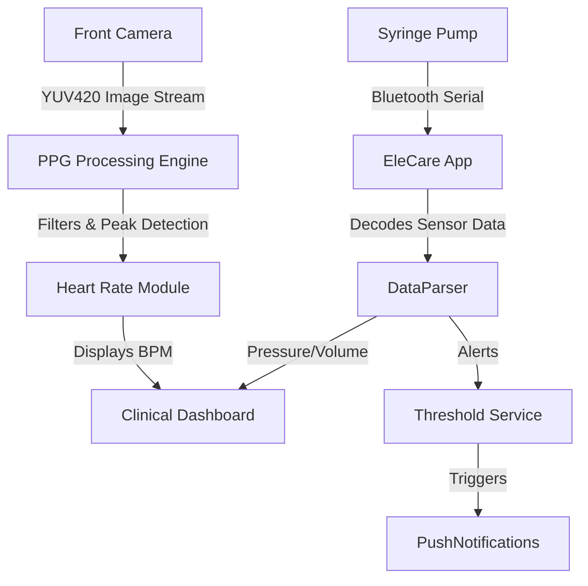

<div align="center">
  
  
  # 🐘 EleCare
  **Smart Syringe Pump Monitoring & Control Application**

  [](https://flutter.dev)
  [](https://dart.dev/)
  [](https://android.com)
  [](https://www.bluetooth.com/)
  [](https://sqlite.org/index.html)
  
  <p>
    <i>Next-generation pediatric infusion monitoring with an interactive, friendly companion.</i>
  </p>
</div>

<hr />

## 📖 Table of Contents
- [🌟 Overview](#-overview)
- [✨ Key Features](#-key-features)
  - [🩺 Clinical Mode](#-clinical-mode)
  - [🎈 Kids Mode](#-kids-mode)
- [📸 Screenshots](#-screenshots)
- [🛠️ Architecture & Under the Hood](#️-architecture--under-the-hood)
- [🌐 Bilingual & Accessibility](#-bilingual--accessibility)
- [🚀 Getting Started](#-getting-started)
- [📂 Project Structure](#-project-structure)
## 🌟 Overview

**EleCare** is an advanced, dual-mode Flutter application engineered to interface natively with custom Smart Syringe Pump hardware via Bluetooth. 

Built with both the **healthcare professional** and the **pediatric patient** in mind, it provides robust, real-time medical monitoring capabilities while completely reimagining the pediatric hospital experience through immersive distraction therapy features.

<p align="center">
  
</p>

---

## ✨ Key Features

### 🩺 Clinical Mode
> **A strict, reliable, and precise dashboard designed for medical personnel:**

* **⚡ Bluetooth Comm. Engine**: High-frequency real-time telemetry from the syringe hardware using `flutter_bluetooth_serial`.
* **📊 Live Telemetry & Monitoring**: Immediate, zero-latency visualization of:
  * 🔄 Infusion progress & volume delivered.
  * ⚠️ Pressure occlusion (FSR sensor data) monitoring bounds.
  * 📈 Dynamic flow rate and sensor charts.
* **❤️ Camera-Based Heart Rate (PPG)**: An innovative built-in photoplethysmography (PPG) engine that uses the front-facing camera to reliably calculate the patient's heart rate—no external sensors required.
* **🗄️ Built-in Drug Library**: Persistent repository powered by SQLite for selecting medications and calculating proper safety thresholds.
* **🔔 Intelligent Alarm System**: Configurable safety thresholds with immediate visual alerts and notifications for line occlusions or syringe completion.
* **📜 Session History**: Automatically logs all treatments to the local SQLite database for retroactive auditing.

---

### 🎈 Kids Mode
> **A dedicated, magical interface designed specifically to reduce treatment anxiety, guided by Ellie the Elephant:**

* **🗣️ Verbal Companion**: Ellie features auto-speech to encourage the child and guide them through calming breathing exercises.
* **🎤 "Talk to Ellie"**: Advanced voice-recognition and Pitch-shifted Text-to-Speech allows kids to talk to Ellie, who repeats what they say in a cheerful, high-pitched voice!
* **🎮 "Catch the Drops" Mini-Game**: 
  * 💧 Immersive interactive game where kids tap to catch falling medicine drops (💧💊🩹).
  * ✨ Features spark particle effects, live score tracking, and immersive celebratory logic.
  * 🎯 Takes the focus off the IV line and puts it on a fun, rewarding challenge.

---
## 📸 Screenshots

| Clinical Dashboard | Camera HR Scanner (PPG) | Kids Interaction Mode | Memory Game |
| :---: | :---: | :---: | :---: |
|  |  |  |  |


---

## 🛠️ Architecture & Under the Hood

### ⚙️ Technology Stack
*   **UI/UX Framework**: Flutter (Dart) with `Provider` state management.
*   **Hardware Interface**: Classic Serial Bluetooth communication over RFCOMM.
*   **Local Database**: SQLite via `sqflite` for Session and Alarm persistence.
*   **Sensory Processing**: Native Camera stream analysis (frame-by-frame processing) extracting the RED chrominance (Cr) plane to derive pulse signals.
*   **AI/Voice Context**: Native Speech-to-Text (`speech_to_text`) and Text-to-Speech (`flutter_tts`).

### 🧱 System Flow Diagram


---

## 🌐 Bilingual & Accessibility

EleCare natively supports both **English** and **Arabic**, respecting cultural contexts:
*   Fully responsive RTL & LTR UI transitions without broken layouts.
*   `en-US` and `ar-SA` locale adaptation for both Voice Recognition (STT transcription) and the spoken text-to-speech engine.

---

## 🚀 Getting Started

### Prerequisites
*   **Flutter SDK**: `>=3.0.0 <4.0.0`
*   **Physical Android Device**: Highly recommended over an emulator. Bluetooth connection, Camera stream processing, and Microphone dependencies will fail on standard emulators.

### Installation

1. **Clone the repository**
   ```bash
   git clone https://github.com/nourahmedmohamed1/syringePump.git
   cd syringePump
   ```

2. **Fetch Dependencies**
   ```bash
   flutter pub get
   ```

3. **Run the App via USB/Wifi Debugging**
   ```bash
   flutter run
   ```

---

## 📂 Project Structure

A clean, modular, and feature-driven architecture:
```text
lib/
├── core/
│   ├── constants/    # Global Theme, Thresholds, App config
│   ├── models/       # Data class (SensorData, Drug, HrReading, Session)
│   └── utils/        # Generic parsers, math helpers
├── providers/        # State Management (PumpProvider)
├── services/         # Core Device Operations
│   ├── camera_ppg_service.dart      # Custom Heart Rate algorithm
│   ├── classic_bluetooth_service.dart # Serial Comm engine
│   ├── database_service.dart        # SQLite config
│   └── threshold_service.dart       # Alarm evaluation constraints
└── ui/
    ├── screens/      # Full page layouts (Dashboard, Setup, HR Screen)
    └── widgets/      # Isolated reusable components (Charts, Cards, Mascot)
```

---

---
## 📧 Contact
**Project Contributer**: Habiba Ahmed

- [GitHub]()
- [LinkedIn]()

**Project Contributer**: Nour Ahmed
- [GitHub](https://github.com/nourahmedmohamed1)
- [LinkedIn](https://linkedin.com/in/nn-anwar)

**Project Contributer**: ......
- [GitHub]()
- [LinkedIn]()

**Project Contributer**:........
- [GitHub]()
- [LinkedIn]()

**Project Contributer**: ......
- [GitHub]()
- [LinkedIn]()


---

<div align="center">


</div>
